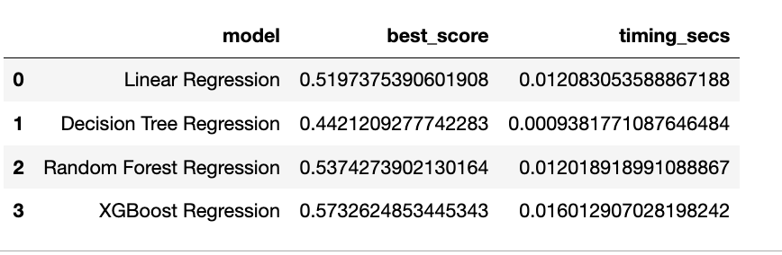
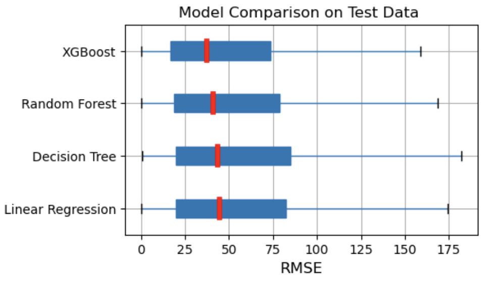

# Capstone Project - AI/ML Certificate - UC Berkeley

# Short term rental - listing price estimator
An analysis of 8680 rental listings for the city of San Francisco used to model a listing price estimator 

## Contents
- Business Summary
- Objective
- Rationale
- Methodology
- Evaluation
- Recommedations and next steps
- Conclusion

## Business Summary
A short-term rental is a furnished, self-contained living space, like an apartment or house, that is rented out for short periods of time, typically from a few days to a few weeks, but some could extend up to a month or longer. They often serve as a cost-effective alternative to traditional hotels, catering to diverse travel needs and preferences, offering more space and amenities for visitors. Short-term rentals have become increasingly popular in recent years, driven by factors like the sharing economy, travel trends, and technological advancements. They offer a more immersive experience in a local neighborhood compared to hotel locations. Booking usually happens through online platforms like Airbnb, VRBO, or directly with the owner.

## Objective
Using the short term rental data provided by opendatasoft, analyze the available listings with their amenities, customer reviews to create a regression model to predict listing price. Create four different regressors - LinearRegression, DecisionTree, RandomForest and GradientBoost algorithms to compute the possible listing price. Further improve the regressors by identifying hyperparameters to improve the performance.
Datasource: https://public.opendatasoft.com/explore/dataset/airbnb-listings/export/?disjunctive.host_verifications&disjunctive.amenities&disjunctive.features&refine.city=San+Francisco

## Rationale
Short term property owners do not have an efficent way to decide the listing price. Platforms like VRBO,AirBnB provide can option for dynamic pricing, which the property owners/managers do not have any control. By integrating with the VRBO,AirBnB apis, this approach can assist property owners/managers to better handle their listing efficiently.

## Methodology
Scikit-learn regression models - LinearRegression, DecisionTree, RandomForest, GradientBoost. Tuned using hyperparameters where necessary.

## Evaluation

  

## Recommendations and Next steps
Dataset used as part of this exercise is for the city of San Francisco and the approach can be scaled at national and international levels. 
GradientBoost performed better when compared to other models, but had a slower response. The saved gradientboost model can be loaded and evaluated through an api endpoint, 
thereby providing a means to integrate with AirBnB,VRBO api. Load more dataset for better accuracy. Expand the feature set to include amenities and features.

## Conclusion
Listing price for short-term rental seems to mainly based on bedrooms, #people accomodated, beds, bathrooms,cleaning fee as per this model.  

